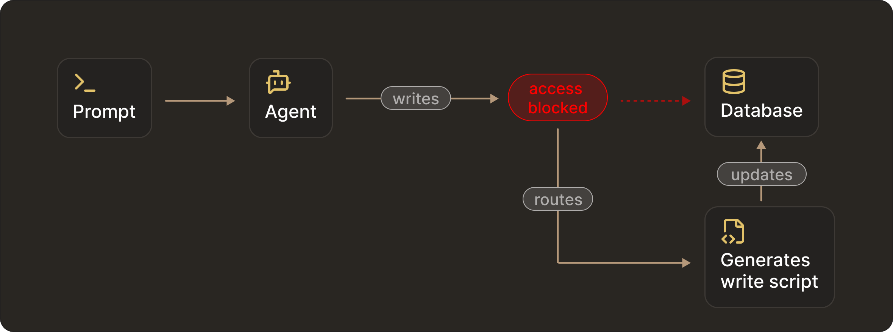
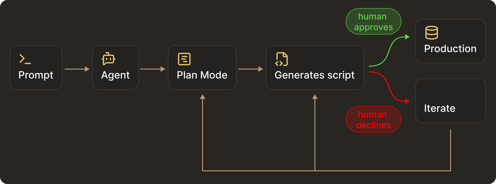
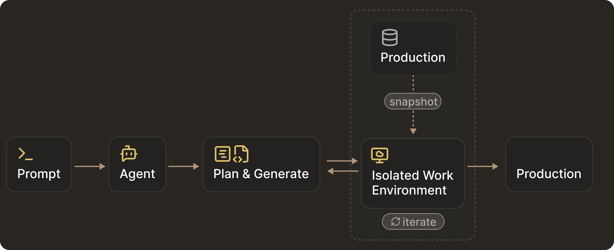
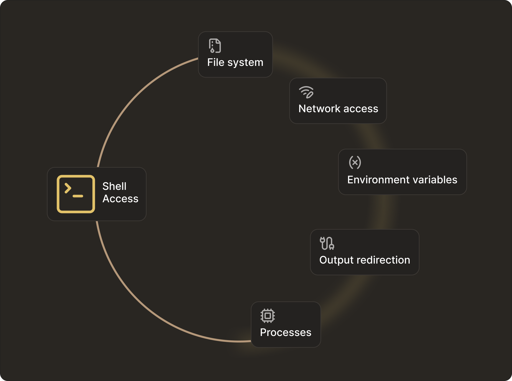

# How to Give Coding Agents Access to SSH and Databases (Without Breaking Production)

As AI agents become more capable, teams are trying to limit the damage they can do when given access to SSH or production databases. 
Common approaches include:

- Command allowlists: allow `ls`, `cat`, `grep`, `tail`; block `rm`, `mv`, `chmod`.
- SQL filters: Allow `SELECT`; block `INSERT`, `DELETE`, `DROP`.
- Manual approval flows: Run everything in `read-only` mode until a human explicitly accepts changes.


These practices assume that constraining agent behaviour through rules, filters, and approvals can prevent dangerous actions. 

This assumption is wrong.

Allowlists, prompts, and approval dialogs are **control surfaces** that influence what an agent chooses to do. Shells, credentials, runtimes, and database roles function as **execution surfaces**, defining what the system can do.

Risk is determined by execution surfaces, not control surfaces. 

Enforcing safety at the behavior layer isn’t the solution. What follows is why these approaches fail in practice - and what actually holds up in production.

## Why database-level controls fail

Human engineers rarely connect to primary databases with full access. They query replicas or views that cannot change production data. The same principle must apply to agents, but it is not enough to enforce this only at the query level.

There are several reasons for this.

First, SQL filtering is unreliable. Even if you block write statements, many databases still support queries that trigger full table scans. Constructs like `SELECT INTO` can introduce new tables, and functions can produce side effects.

Second, read access alone is dangerous. It can expose authentication tokens, PII, or operational metadata. This is why databases themselves do not rely on client-side query validation and instead implement safety through roles, views, and replicas.

Re-implementing parts of this logic in the agent layer with regexes or heuristics is both fragile and incomplete.

## Agents route around blocked tools

An agent’s goal is task completion. Blocking individual tools does not mean entire classes of state changes are prevented. For example, if the agent finds that direct deletion within a database schema is blocked, it will reach the same outcome by putting together other allowed operations. 

In this case, even though direct access to the tool is blocked, it doesn't prevent many other possible walkarounds that could apply undesired changes to the production system.




In practice, this can include writing a script that performs deletion or just invoking a different tool that indirectly gives the expected outcome. This is not adversarial behavior. Instructions, allowlists, and approval dialogs influence behavior, but they do not define what the system is capable of doing. 

For that reason, safety cannot live solely inside the model. It must be enforced outside the model through OS permissions, roles, and tool interfaces. Access control is not a prompting problem. It's an infrastructure problem that will require explicit separation between reasoning and execution, with enforcement applied at deterministic execution boundaries.

## What actually holds up in production

### 1. `Read-only` access still allows irreversible damage

In one setup, we exposed production data to an agent exclusively through a read-only tool interface backed by a `SELECT-only` database role. On paper, this appeared safe - the agent could inspect data but had no explicit write tools.

However, as long as the agent retained access to a general execution surface (shell access, runtime file system, or database credentials), it simply routed around the restriction, generating its own script and updating the database through an unintended path.


<video
        controls
        style={{
        width: "100%",
        borderRadius: "8px",
        boxShadow: "0 4px 12px rgba(0, 0, 0, 0.15)",
        }}
    >
        <source src="https://assets.docs.getpochi.com/agent-routes-around.mp4" type="video/mp4" />
        Your browser does not support the video tag.
    </video>

We removed the execution surface entirely and enforced read-only access at the infrastructure level. This involved revoking database write permissions and disabling shell execution. Post this, the agent could reason freely but could no longer apply any changes.


<video
        controls
        style={{
        width: "100%",
        borderRadius: "8px",
        boxShadow: "0 4px 12px rgba(0, 0, 0, 0.15)",
        }}
    >
        <source src="https://assets.docs.getpochi.com/requires-human-approvals.mp4" type="video/mp4" />
        Your browser does not support the video tag.
    </video>

Even when `read-only` access is enforced at the infrastructure level, production access still depends on human approval. Over time, these approvals tend to degrade into procedural steps. Auto-approve paths appear, reviews become mechanical, and the safety boundary weakens.

As a result, granting agents direct access to production databases, even in read-only mode, is best avoided. Agents are non-deterministic by design, and production systems should not be exposed to that uncertainty.

The challenge is that many legitimate tasks still require writes.

### 2. Writes must flow through existing deployment pipelines

Many engineering tasks involve backfills, schema updates, and data correction. All of these require write access.

Giving an agent write access to production data under these circumstances is rarely acceptable. A more robust pattern is to let agents propose changes, generate and test migration scripts, and iterate freely. But applying those same changes to production will still wait on explicit human approval.




This mirrors standard engineering practice. It avoids giving production credentials to agents and ensures all changes are auditable and reversible.

The tradeoff is slower iteration, because agents can’t validate assumptions against real production data. This is where isolated writable environments become important.


### 3. Isolated writable environments enable safe iteration

Isolated Writable Environments (IWEs) are disposable database instances that mirror production schema and data. Within these environments, agents can evolve schemas, validate queries, and test migrations freely. Once the changes are ready, the same test and migration scripts can be replayed through the original production pipelines.




In practice, combining IWEs with gated production deployment yields the best results. You get the agent to perform actions against isolated databases while production remains gated by standard deployment processes.

The same principle applies outside the database layer. With SSH and shell access, the execution surface becomes effectively unbounded unless similar infrastructure-level boundaries are enforced.

## Why shells make safety undefined

A shell is a general-purpose programming environment. Once exposed, safety boundaries become undefined.

An agent can use `cat` to overwrite files, using `grep` can exfiltrate secrets, and `tail -f`, if used on the wrong file, can leak sensitive data indefinitely. On the other hand, having an allowlist to control which binaries are executed does not automatically constrain the kind of operations that are possible on the system.

Having a shell exposed grants access to the file system, process creation, and the environment state. And once a shell exists, the boundary of what is allowed is no longer clear.




The safest designs accept this and shift the focus from preventing mistakes to containing them.

### Disposable environments

The simplest and most reliable pattern is to treat any machine an agent can access as disposable. This way when something goes wrong, you just replace the whole thing and not spend time to fix it. This is already how CI systems operate, and increasingly how dev environments are provisioned.

Instead of connecting agents to long-lived servers, teams route them to short-lived containers, ephemeral VMs or dev sandboxes per task or per session. This way agents are free to modify files, install packages and experiment with configurations.  But this introduces infrastructure cost while reducing production impact. 

### Restricted hosts and forced commands

Some teams still require agents for log inspection, operational debugging, or controlled maintenance. But even in these cases, full interactive shells are rarely necessary. Common restrictions can include: 

- SSH users with no home directory and limited permissions
- forced commands in `authorized_keys` so only specific scripts can run
- wrapper binaries that expose narrow actions instead of general shells

For example, instead of allowing: 

```bash
ssh agent@host
```
the key may enforce:

```bash
command="/usr/local/bin/fetch-logs.sh"
```

This reduces damage area but comes with its own pitfalls. Debugging can become harder and workflows might require constant tooling updates.

Structured tools and APIs provide stronger safety guarantees than shells.. A shell exposes the file system, environment variables and network access - making it impossible to create boundaries without building a second operating system around it.

This approach already mirrors how human access to infrastructure has evolved as well. We now have fewer SSH sessions, more pipelines, dashboards, and automation APIs. Agents benefit from the same shift, for the same reasons.

### Conclusion

Throughout this post, we saw the same pattern repeat across different systems. When the agent was instructed to follow safety, through instructions, prompts, or behavioral constraints, it failed. Whereas, when safety was enforced through infrastructure (roles, isolation, and execution boundaries), it held.

Many teams make this fundamental mistake of treating access control as a prompting problem instead of a system problem.

The only reliable way to make agents safe is to design environments where destructive actions are physically unreachable, and all state changes flow through auditable, deterministic systems. Once safety is achieved by design, mistakes become recoverable, contained, and reviewable - and only then can agents be given meaningful autonomy across real production use cases.