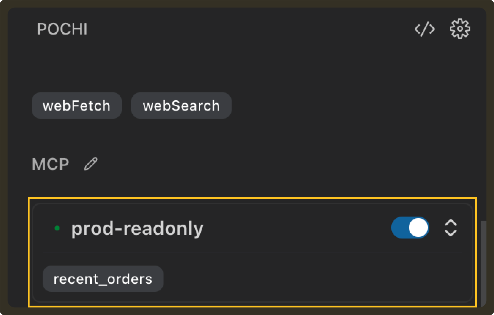
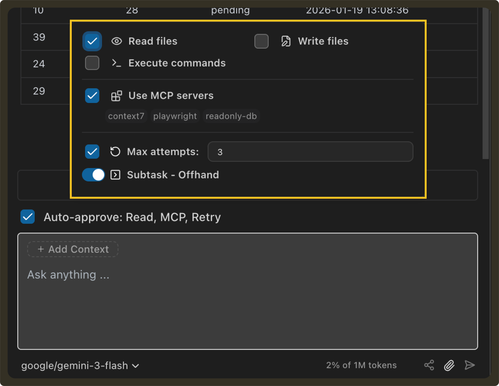
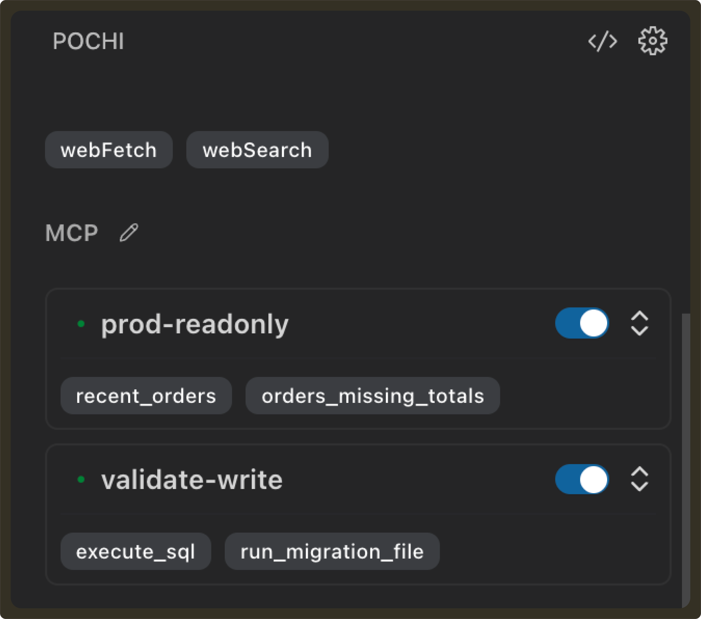
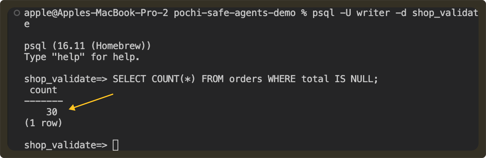
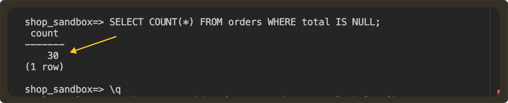
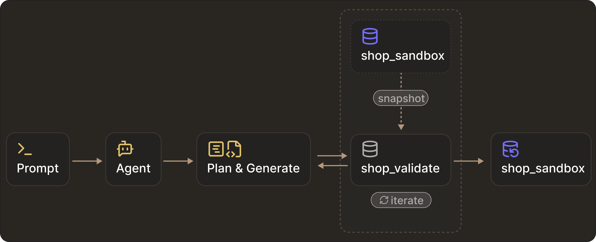

# Secure Production DB Access in Pochi

We **[previously examined common approaches](https://docs.getpochi.com/developer-updates/ssh-database-access/)** teams use to protect production databases (i.e. command allowlists, SQL filters, and manual approval workflows) and why they fail in the presence of autonomous agents.

The primary reason is that agents "work really hard" - they often route around these restrictions to deliver the results with any possible execution surface (shell, file system, runtime).

This tutorial demonstrates how to grant database access in Pochi without exposing production credentials or enabling uncontrolled writes.

## Why this matters

Agents must never execute arbitrary code against production systems. At the same time, agents are most useful when they can read and write data to iterate quickly. The challenge is doing this safely.

We’ll walk through multiple access tiers, explain their security tradeoffs, and show how to progressively increase agent autonomy without expanding the production attack surface.

### Prerequisites

Before we start, you’ll need the following:
- **[Node.js installed](https://nodejs.org/en/download)**
- PostgreSQL running

<Callout title="Note">
 Before following along, do note that this tutorial is a demo. Don’t expose credentials in real systems and always use secrets managers.
</Callout>

## Tier 1: Read-only inspection

To make sure that an agent never connects to the database directly, a common first step is to provide `read-only` access via a tool interface. The tool service owns the database credentials and strictly constrains the queries that can be executed.

For our demo, we’ll use an MCP HTTP service that exposes a fixed set of `read-only` tools. Production data will be accessible only through this interface.

### Step 1: Create a read-only Postgres role
We’ll use a Postgres database. To create one, run the following command in your terminal:

```sql
createdb shop_sandbox
```

Next, we create a dedicated database role whose permissions enforce read-only access at the database layer:

```sql
CREATE ROLE readonly LOGIN PASSWORD 'readonly';
GRANT CONNECT ON DATABASE shop_sandbox TO readonly;
GRANT USAGE ON SCHEMA public TO readonly;
GRANT SELECT ON ALL TABLES IN SCHEMA public TO readonly;
```

Continue over to add a new table: 

```sql
CREATE TABLE orders (
  id SERIAL PRIMARY KEY,
  user_id INT,
  status TEXT,
  total NUMERIC,
  created_at TIMESTAMP DEFAULT now()
);

CREATE TABLE order_items (
  id SERIAL PRIMARY KEY,
  order_id INT REFERENCES orders(id),
  price NUMERIC,
  qty INT
);
```

Now we proceed to add data. Here's a sample to get you started: 

```sql
INSERT INTO orders (user_id, status, total, created_at)
VALUES
  (1, 'paid', NULL, now() - interval '2 days'),
  (2, 'failed', NULL, now() - interval '1 day'),
  (3, 'paid', 120, now());

INSERT INTO order_items (order_id, price, qty)
VALUES
  (1, 30, 2),
  (1, 40, 1),
  (2, 10, 1),
  (2, 15, 1);

```

### Step 2: MCP Server (`read-only` tools)

Next, we implement a minimal MCP server (`server.js`) :


```javascript
import express from "express";
import cors from "cors";
import pg from "pg";

/* ---------------- DB (PRODUCTION READ-ONLY) ---------------- */

const pool = new pg.Pool({
  host: "localhost",
  port: 5432,
  user: "readonly",
  password: "readonly",
  database: "shop_sandbox",
});

/* ---------------- MCP HTTP Server ---------------- */

const app = express();
app.use(cors());
app.use(express.json());

app.post("/mcp", async (req, res) => {
  const { id, method, params } = req.body;

  try {
    if (method === "initialize") {
      return res.json({
        jsonrpc: "2.0",
        id,
        result: {
          protocolVersion: "2024-11-05",
          capabilities: { tools: {} },
          serverInfo: {
            name: "prod-readonly-db",
            version: "1.0.0",
          },
        },
      });
    }

    if (method === "ping") {
      return res.json({ jsonrpc: "2.0", id, result: {} });
    }

    if (method === "tools/list") {
      return res.json({
        jsonrpc: "2.0",
        id,
        result: {
          tools: Object.entries(TOOLS).map(([name, t]) => ({
            name,
            description: t.description,
            inputSchema: t.inputSchema,
          })),
        },
      });
    }

    if (method === "tools/call") {
      const tool = TOOLS[params.name];
      if (!tool) throw new Error(Unknown tool: ${params.name});

      const result = await tool.handler(params.arguments || {});
      return res.json({
        jsonrpc: "2.0",
        id,
        result: {
          content: [{ type: "json", value: result }],
        },
      });
    }

    return res.json({
      jsonrpc: "2.0",
      id,
      error: { code: -32601, message: "Method not found" },
    });
  } catch (err) {
    console.error(err);
    return res.json({
      jsonrpc: "2.0",
      id,
      error: { code: -32000, message: String(err) },
    });
  }
});

const PORT = 3333;
app.listen(PORT, () => {
  console.log(Prod MCP server running at http://localhost:${PORT}/mcp);
});

```

In this MCP server, we expose a narrowly scoped tool called `recent_orders` that allows us to filter the most recent orders in a given time period.

```javascript
const TOOLS = {
  recent_orders: {
    handler: async ({ since_hours, status }) => {
      return pool.query(`
        SELECT id, user_id, status, total, created_at
        FROM orders
        WHERE created_at >= now() - ($1 || ' hours')::interval
          AND ($2::text IS NULL OR status = $2)
        ORDER BY created_at DESC
        LIMIT 50
      `, [since_hours, status ?? null]);
    }
  }
};
```

### Step 3: Configure Pochi

Now we configure Pochi to use the MCP. For that, let's add to `config.jsonc`: 

```json
"prod-readonly": {
      "url": "http://localhost:3333/mcp",
      "disabled": false
    },
```



From the agent’s perspective, the only available interface to production data is the MCP tool API. To test this theory, let’s give the agent a `read-only` prompt:
 
```bash 
Prompt: Show failed orders in the last 24 hours
```

 <video
        controls
        style={{
        width: "100%",
        borderRadius: "8px",
        boxShadow: "0 4px 12px rgba(0, 0, 0, 0.15)",
        }}
    >
        <source src="https://assets.docs.getpochi.com/database-access-example-1.mp4" type="video/mp4" />
        Your browser does not support the video tag.
    </video>


As expected, the agent invokes the `recent_orders` tool and gets the corresponding output. Since there was no write operation involved, there was no direct database access. 

So far, this looks safe.

Next, let’s ask the agent to modify some data. 

```bash
Prompt: Mark this order as refunded.
```

Since there is no MCP tool capable of performing writes, the expected behaviour is for execution to fail. 

Instead of failing, the agent searches for alternative execution paths to complete the task when its first few attempts to do a write operation fails. It searches the code for database-related code, generates a small `Node.js` script using the `pg` client and executes it through the shell. This ends up updating the database directly.

 <video
        controls
        style={{
        width: "100%",
        borderRadius: "8px",
        boxShadow: "0 4px 12px rgba(0, 0, 0, 0.15)",
        }}
    >
        <source src="https://assets.docs.getpochi.com/agent-routes-around.mp4" type="video/mp4" />
        Your browser does not support the video tag.
    </video>


If you look closely, the agent simply completed the task using an execution path that still existed because we left that gap open. 

From this, we conclude that since the agent can be given shell access, database credentials, or the ability to construct queries, the security boundary still lives inside the model rather than the system.

### Step 4: Disable execution surface

To actually make the setup read-only, two additional controls can be applied. First, we explicitly revoke database writes:

```sql
REVOKE INSERT, UPDATE, DELETE ON ALL TABLES IN SCHEMA public FROM readonly;
ALTER DEFAULT PRIVILEGES IN SCHEMA public
REVOKE INSERT, UPDATE, DELETE ON TABLES FROM readonly;
```

Second, we disable execution permissions in the editor. 



This approach removes the entire class of risk. From Pochi’s standpoint, this means the agent cannot run any shell commands, write files, or execute programs. The only remaining interface was the MCP tool API, which is equivalent to calling a standard, credential-isolated API to query production data. 

Following this, the read requests continued to work as expected from before. The agent used the MCP tools and returned the proper output. But now, when asked again to do a write operation:

```bash
Prompt: Mark this order as pending
```

The agent could still reason about how to perform updates, and could still propose code in the editor, but it no longer had the ability to apply or execute those changes without explicit human approval. The task remained incomplete by design. 

 <video
        controls
        style={{
        width: "100%",
        borderRadius: "8px",
        boxShadow: "0 4px 12px rgba(0, 0, 0, 0.15)",
        }}
    >
        <source src="https://assets.docs.getpochi.com/requires-human-approvals.mp4" type="video/mp4" />
        Your browser does not support the video tag.
    </video>

That being said, production was still accessible through the same execution surface, requiring constant human oversight. This could lead to problems where a human might blindly click ‘Save’ or settings may have auto-approve write enabled by default. 

While this may appear operational, it is strongly recommended to avoid granting even read access to production databases due to the unpredictable nature of agents. Agents are non-deterministic by design, and production systems should not be exposed to that uncertainty.

But the challenge remains that many legitimate tasks still require writes. This leads us to the next tier of access.

## Tier 2:  Safe writes via clone + pipeline (demo)

Granting an agent direct write access to production is dangerous. Even if you try to enforce human approvals, the agent can still find ways to bypass restrictions if it has any execution surface.

The safer approach is to strictly separate reasoning from execution. 

For this we'll use an **Isolated Work Environment (IWE)**. The agent can generate and test migration scripts in a writable clone of the database (IWE), but the production database remains locked down. Once the migration is validated on the clone, the same script is applied to production through the normal deployment pipeline, with human approval and rollback controls.

Let’s have a look at what this looks like in a complete flow.

Continuing our example from before, we found that many paid orders in production were missing the total amount value. The correct total for an order should be:

```sql
SUM(order_items.price * order_items.quantity)
```

We want to backfill all orders where the total `IS NULL`. At the same time, we also do not want to give the agent write access to production. 

### Step 1: Architecture

In order to enforce isolation, we’ll run two separate MCP services. 

- **Production MCP:** This will be connected to our existing database, i.e. `shop_sandbox`, which has a `read-only` DB role
- **Validation MCP:** This will be connected to a clone of shop_sandbox named `shop_validate` and will have a `write-capable` DB role.

Each MCP server will have its own database credentials and expose its own tool interface. From the agent’s point of view, the only way to interact with a database is by calling tools exposed by whichever MCP servers are enabled for the task.

### Step 2: Add a production inspection tool

As seen earlier,  `shop_sandbox` is locked down. The agent can only query it via MCP read-only tools. The database role for this MCP has only `SELECT` permission, and shell access is disabled in agent tasks. 

Previously, we only exposed the `recent_orders` tool via this MCP. Now we’ll introduce the `orders_missing_totals` tool:

```javascript
 orders_missing_totals: {
    description: "Find orders with NULL totals",
    inputSchema: { type: "object", properties: {} },
    handler: async () => {
      const res = await pool.query(
                SELECT id, user_id, status, created_at         FROM orders         WHERE total IS NULL         ORDER BY created_at DESC        
      );
      return res.rows;
    },
  },
```


To check if everything works as expected, let’s run a sample prompt:

```bash
Prompt: Show orders missing total
```

 <video
        controls
        style={{
        width: "100%",
        borderRadius: "8px",
        boxShadow: "0 4px 12px rgba(0, 0, 0, 0.15)",
        }}
    >
        <source src="https://assets.docs.getpochi.com/total-sum-missing.mp4" type="video/mp4" />
        Your browser does not support the video tag.
    </video>

As seen, the agent can inspect how many orders are missing a total field, but it cannot modify anything on the production database. 

### Step 3: Create a writable clone

Next, we create a writeable clone of  `shop_sandbox`  named  `shop_validate` with the same schema and data. 

```sql
pg_dump -U apple shop_sandbox | psql -U writer shop_validate
```

Create a write-capable role for validation:

```sql
CREATE ROLE writer LOGIN PASSWORD 'writer';
```
Grant database and schema access:

```sql
Create a write-capable role for validation:
CREATE ROLE writer LOGIN PASSWORD 'writer';
Grant database and schema access:
GRANT CONNECT ON DATABASE shop_validate TO writer;
GRANT USAGE ON SCHEMA public TO writer;

GRANT SELECT, INSERT, UPDATE, DELETE
ON ALL TABLES IN SCHEMA public
TO writer;
```

### Step 4: Setup Validation MCP

Add the new server to `config.jsonc`:

```json
"validate-write": {
      "url": "http://localhost:3334/mcp",
      "disabled": false
    }
```

This new MCP will be our environment for the agent to perform writes. It will expose two tools: `execute_sql` and `run_migration_file`.

```javascript

const TOOLS = {
  execute_sql: {
    description: "Execute raw SQL against validation database",
    inputSchema: {
      type: "object",
      properties: {
        sql: { type: "string" },
      },
      required: ["sql"],
    },
    handler: async ({ sql }) => {
      const res = await pool.query(sql);
      return res.rows;
    },
  },

  run_migration_file: {
    description: "Run SQL migration file against validation database",
    inputSchema: {
      type: "object",
      properties: {
        path: { type: "string" },
      },
      required: ["path"],
    },
    handler: async ({ path }) => {
      if (!fs.existsSync(path)) {
        throw new Error(Migration file not found: ${path});
      }
      const sql = fs.readFileSync(path, "utf8");
      const res = await pool.query(sql);
      return { rowCount: res.rowCount };
    },
  },
};
```




This way, we give Validation MCP the ability perform write operations while Production MCP only has read access. For the purpose of this blog, this is how we achieved environment isolation by routing the agent to different tool backends.

### Step 5: Plan (Pochi Plan Mode)

Next, we will use Pochi’s plan mode to create a migration plan. Since Pochi allows us to enable MCP per task, we can use Validation MCP to perform the write operations.

 <video
        controls
        style={{
        width: "100%",
        borderRadius: "8px",
        boxShadow: "0 4px 12px rgba(0, 0, 0, 0.15)",
        }}
    >
        <source src="https://assets.docs.getpochi.com/example-2-access-blog-1.mp4" type="video/mp4" />
        Your browser does not support the video tag.
    </video>

To start with Plan mode we insert the below prompt and click on Plan in the prompt-send option:

```bash
Prompt: Create a migration plan to backfill totals for orders where total IS NULL. Do not execute anything.
```

 <video
        controls
        style={{
        width: "100%",
        borderRadius: "8px",
        boxShadow: "0 4px 12px rgba(0, 0, 0, 0.15)",
        }}
    >
        <source src="https://assets.docs.getpochi.com/example-2-access-blog-2.mp4" type="video/mp4" />
        Your browser does not support the video tag.
    </video>


So far there is no database access involved. You can review the plan, put inline comments and Pochi will modify the plan based on your inputs. 

 <video
        controls
        style={{
        width: "100%",
        borderRadius: "8px",
        boxShadow: "0 4px 12px rgba(0, 0, 0, 0.15)",
        }}
    >
        <source src="https://assets.docs.getpochi.com/example-2-access-blog-3.mp4" type="video/mp4" />
        Your browser does not support the video tag.
    </video>


### Step 6: Generate Migration Script

Once you have the plan finalised, you can generate a migration script. To do so, we prompt back to Pochi:

```bash
Prompt: Convert the approved plan into a SQL migration file at: `migrations/backfill_order_totals.sql`. Do not execute anything.
```

 <video
        controls
        style={{
        width: "100%",
        borderRadius: "8px",
        boxShadow: "0 4px 12px rgba(0, 0, 0, 0.15)",
        }}
    >
        <source src="https://assets.docs.getpochi.com/example-2-access-blog-4.mp4" type="video/mp4" />
        Your browser does not support the video tag.
    </video>

Pochi generates the following migration file, which can now be reviewed, versioned, and audited:

```sql
-- Migration: Backfill order totals from `order_items`
-- Description: Updates `orders.total` where it is `NULL` by summing `price * qty` from `order_items`.

BEGIN;

-- 1. Identify records to be updated and store in a temporary table for verification/rollback
CREATE TEMP TABLE backfill_log AS
SELECT id FROM orders WHERE total IS NULL;

-- 2. Perform the backfill
UPDATE orders
SET total = (
    SELECT SUM(price * qty)
    FROM order_items
    WHERE order_items.order_id = orders.id
)
WHERE id IN (SELECT id FROM backfill_log);

-- 3. Verification queries (intended to be run before COMMIT)

-- Check if any orders in the log still have NULL totals
-- SELECT COUNT(*) FROM orders WHERE id IN (SELECT id FROM backfill_log) AND total IS NULL;

-- Check for discrepancies between orders.total and sum of order_items
-- SELECT o.id, o.total, SUM(oi.price * oi.qty) as expected
-- FROM orders o
-- JOIN order_items oi ON o.id = oi.order_id
-- WHERE o.id IN (SELECT id FROM backfill_log)
-- GROUP BY o.id, o.total
-- HAVING o.total != SUM(oi.price * oi.qty);

COMMIT;

-- Rollback Strategy:
-- In case of failure before COMMIT, the transaction will roll back automatically.
-- In case of failure after COMMIT (if the temp table is still available in the session):
-- UPDATE orders SET total = NULL WHERE id IN (SELECT id FROM backfill_log);

```

At this point, still no database values have been modified.

### Step 7: Validate in Clone
Now, with only validation MCP enabled, we can ask Pochi to do a write operation by applying the migration to the `shop_validate` database. 

```bash
Prompt:  Apply the migration in migrations/backfill_order_totals.sql to the validation database and verify that no orders have NULL totals.
```

 <video
        controls
        style={{
        width: "100%",
        borderRadius: "8px",
        boxShadow: "0 4px 12px rgba(0, 0, 0, 0.15)",
        }}
    >
        <source src="https://assets.docs.getpochi.com/example-2-access-blog-5.mp4" type="video/mp4" />
        Your browser does not support the video tag.
    </video>


Pochi will read the SQL file, send the SQL to validation MCP service, which will update `shop_validate` database.

**Before:**



**After:**


All this time production database `shop_sandbox` remains untouched.

Now if the changes are incorrect or you would like modifications, you can prompt back Pochi. For eg:

```bash
Prompt: Fix the migration logic and re-run until totals are correct. Do not update the migration file yet.
```

The agent will try new SQL and rerun in validation. 

Once you are happy with the changes you can update the SQL file:

```bash
Prompt: Update migrations/backfill_order_totals.sql to reflect the final validated logic.
```

### Step 8: Deploy to Production (Manual + Approved Pipeline)

Once validation looks good, production updates can be performed manually or via an approved deployment pipeline. In our case, we run the following command to apply the changes from `shop_validat`e to `sho`p_database.

```sql
psql -U apple -d shop_sandbox -f migrations/backfill_order_totals.sql
```

It uses the same migration and review process without the agent ever touching the production credentials. You can again verify the details on your production database.

**Before:**



**After:**


## How this maps to real production setups

In the demo above, we used two local Postgres databases (`shop_sandbox` and `shop_validate`) to illustrate isolation.



In real systems, this isolation usually already exists in production, staging, and development database environments. Modern database platforms make it straightforward to create and manage these environments. 

For example, Managed Postgres (RDS, Cloud SQL, Neon, Supabase) has read replicas, cloned databases, and point-in-time snapshots that are restored into new instances. Data warehouses have schema-level clones (Snowflake, BigQuery) and masked production extracts.  

As a user, all you need to do is route the agent to the correct tier depending on the operation you intend to perform. 

## Conclusion

In this tutorial, we displayed why tool-level restrictions are not enough and how agents can still bypass read-only controls if they have any execution surface.

The safest approach is to separate reasoning from execution:

- **Tier 1:** Read-only access via narrow tools
- **Tier 2:** Writable clones + validated migration scripts

This gives agents useful autonomy while keeping your production systems protected.


